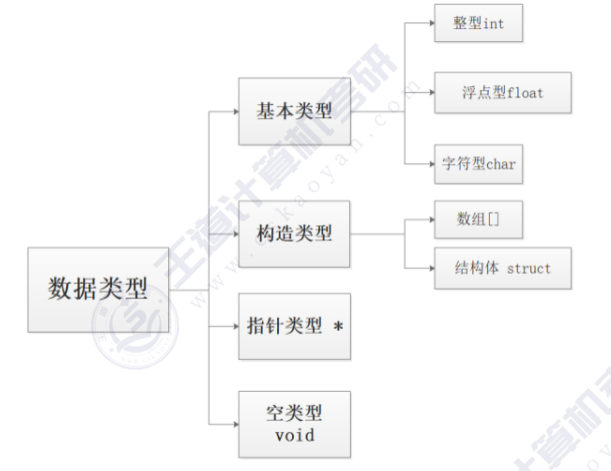
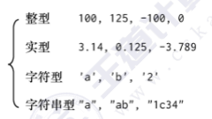
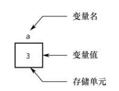
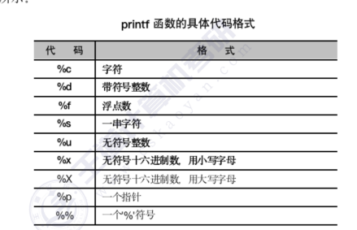
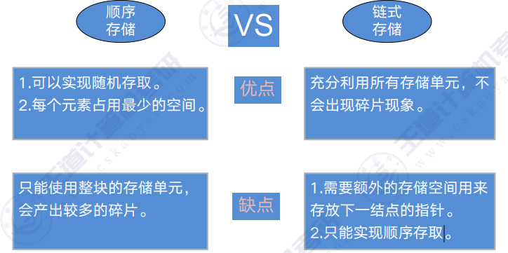

# C语言

本文目录：

[TOC]


## 第一章

```c
#include <stdio.h>//printf函数需要使用该头文件
//调试时，蓝色代码表示还未运行
int main() {
    printf("Hello, World!\n");//clion参数提示。
    return 0;
}
//通过编译得到可执行文件，可执行文件中都是机器码0/1，才能被cpu运行
```

## 第二章——数据的类型，输入输出

### 2.1 数据类型



### 2.2 常量



引号中的内容无论是ASCII码还是汉字或其它国家文字，都是字符串常量。

### 2.3 变量

变量为存储单元



标识符第一个字符必须为字母或下划

### 2.4 整形数据

#### 4.4.1 符号常量

```c
#include <stdio.h>
#define PI 3+2
int main() {
    int i=PI*2;
    printf("i=%d\n",i);
}//符号常量PI是直接替换的结果

```

结果为7而不是10

#### 4.4.2 整型变量

 int i 是四个字节

f是4个字节

c是字符型 1个字节

字符常量存入字符变量时放入的是ASCII码

大写到小写----+32

不可以将字符串型常量赋给字符型变量。

\0表示字符串结束标志，，输出时不输出，所以"CHINA"是6字节

### 强制类型转换

printf:格式化字符串

ii


### 8.2结构体对齐

如果有数组是按照看数组的类型占几个字节，找到所有


### 8.3 结构体指针与typedef


一个结构体变量的指针就是该变量所占据内存段的起始地址。（这也是指针变量里面可以存任何类型变量的地址的原因）

```c
struct student{
int num;4
char name[20];
char sex;
};
int main()
{
    struct student s={1001,"diaomao",'M'};
    struct student sarr[3]={1002,"lele",'M',1003,"nvhao",'F',1008,"queadiao",'M'};
    struct student *p;//定义结构体指针
    int num;
    p=&s;//取这个结构体的起始地址
    printf("%d %s %c\n",p->num,p->name,p->sex);//p->num与（*p）.num等价，如果不加括号会报错，结构体的点成员选择运算符优先级比取值运算符的优先级高。
    p=sarr;//等价于sarr[0]
    printf("%d %s %c\n",(*p).num,(*p).name,(*p).sex);
    printf("%d %s %c\n",p->num,p->name,p->sex);
    printf("---------------------------\n");
    p=p+1;
    printf("%d %s %c\n",p->num,p->name,p->sex);
    return 0;
}
```


利用typedef起别名:

struct student=stu

pstu=struct student*

在定义指针变量时既可以使用：stu*p 或 pstu p

局部变量的名字可以和结构体某一个成员的名字相同

```c
typedef struct student{
    int num;
    char name[20]; 
    char sex;
}stu,*pstu;
typedef int INTEGER;//int起别名在特定的地方如果要改就只需要统一改就会方便
int main()
{
    stu s={1001,"wangle",'M'};
    pstu p;
    INTEGER i=10;
    p=&s;
    printf("i=%d,p->num=%d\n",i,p->num);
    return 0;
}
```

小写Integer可以区分出未赋值和值为0的区别

### 8.3 c++引用

优点：在子函数内的操作和函数外的操作一致，编程效率高

作用：在子函数中如果要改变主函数中变量的值时就加引用

```c
#include <stdio.h>
void modify_num(int &b)//形参中出现&不叫取地址，通常叫引用
{
    b=b+1;
}
//c++引用
//在子函数内修改主函数的普通变量
int main() {
    int a=10;
    modify_num(a);
    printf("a=%d",a);
    return 0;
}

```

子函数中修改主函数的一级指针变量

```c
#include <stdio.h>
void modify_pointer(int*&p,int*q)//引用必须和变量名紧邻
{
    p=q;
}
int main() {
    int *p=NULL;//数据结构中大量用到指针变量，比如链表，二叉树，排序
    int i=10;
    int *q=&i;
    modify_pointer(p,q);
    printf("*p=%d",*p);
    return 0;
}
```


#### Ｃ语言中不允许动态数组类型。

用变量表示长度，想对数组的大小作动态说明，这是错误的。但是在实际的编程中，往往会发生这种情况，即所需的内存空间取决于实际输入的数据，而无法预先确定。对于这种问题，用数组的办法很难解决。为了解决上述问题，Ｃ语言提供了一些内存管理函数，这些内存管理函数可以按需要动态地分配内存空间，也可把不再使用的空间回收待用，为有效地利用内存资源提供了手段。

常用的内存管理函数有以下三个：

##### 1、分配空间内存函数malloc

- 调用形式

​	

```
(类型说明符*)malloc(size)
```


功能：在内存的动态存储区中分配一块长度为"size"字节的连续区域。函数的返回值为该区域的首地址。

“类型说明符”表示把该区域用于何种数据类型。

(类型说明符*)表示把返回值强制转换为该类型指针。

“size”是一个无符号数。

例如：

​     pc=(char *)malloc(100);

表示分配100个字节的内存空间，并强制转换为字符数组类型，函数的返回值为指向该字符数组的指针，把该指针赋予指针变量pc。

##### 分配内存空间函数calloc

```
(类型说明符*)calloc(n,size)
```


功能：在内存动态存储区中分配n块长度为“size”字节的连续区域。函数的返回值为该区域的首地址。

(类型说明符*)用于强制类型转换。

calloc函数与malloc 函数的区别仅在于一次可以分配n块区域。

例如：
   ps=(struet stu*)calloc(2,sizeof(struct stu));

其中的sizeof(struct stu)是求stu的结构长度。因此该语句的意思是：按stu的长度分配2块连续区域，强制1转换为stu类型，并把其首地址赋予指针变量ps。

##### 释放内存空间函数free

```
free(void*ptr);
```

功能：释放ptr所指向的一块内存空间，ptr是一个任意类型的指针变量，它指向被释放区域的首地址。被释放区应是由malloc或calloc函数所分配的区域。

### 9.3逻辑结构与存储结构

|          |          |          |          |          |
| -------- | -------- | -------- | -------- | -------- |
| 逻辑结构 | 集合     | 线性     | 树形     | 图形     |
| 存储结构 | 顺序存储 | 链式存储 | 索隐存储 | 散列存储 |



随机：可以任意到某个元素，取任何位置只要知道地址就可以直达，时间复杂度相等。

```
//顺序存储
int Array[6]={1,2,3,4,5,6}
printf("%d\n",Array[3])//随机存取
```

[结构体指针的用法](#8.3 结构体指针与typedef)

[malloc用法](#1、分配空间内存函数malloc)

```
#链式存储
typedef struct Lnode{
	ElemType data;
	struct Lnode *next;
}Lnode,*LinkList;
Lnode *L;//或者是LinkList L
L=(LinkList)malloc(sizeof(Lnode));
A->next=B;
B->next=c
```

### 9.4时间复杂度与空间复杂度

时间复杂度描述：算法中所有语句（执行次数之和）：

$T(n)=O(f(n))$       大题一定要带上大O

